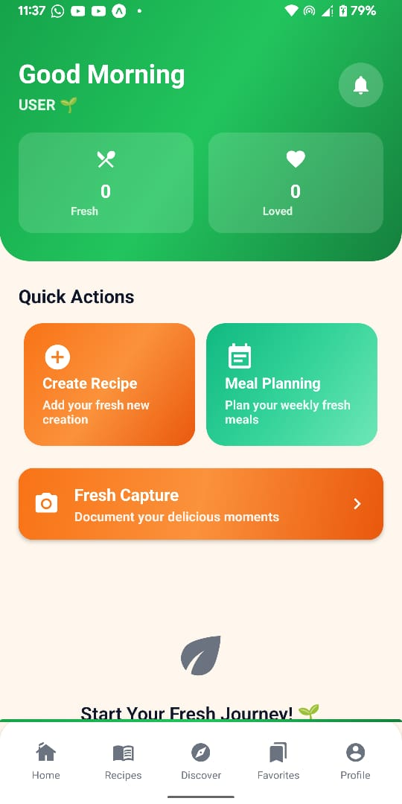
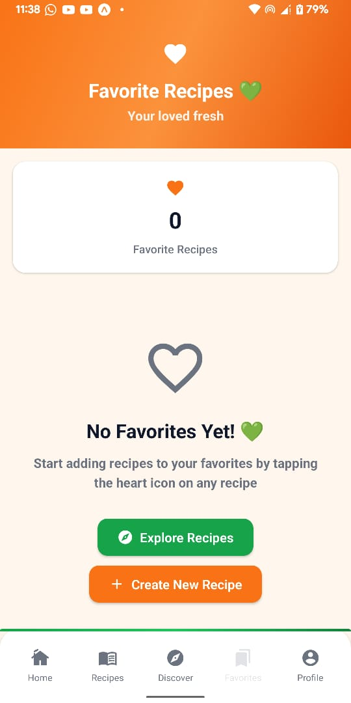

# 🍽️ Flavour Hub - Your Personal Recipe Companion

<div align="center">
  
  
  **Discover, Create, and Share Amazing Recipes**
  
  [](https://expo.dev)
  [](https://reactnative.dev)
  [](https://www.typescriptlang.org)
  [](https://firebase.google.com)
</div>

## 🎥 Demo Video

<div align="center">
  <a href="https://youtu.be/UmmTRJb22qs" target="_blank">
    
  </a>
  
  **🔗 [View Full Demo on YouTube](https://youtu.be/UmmTRJb22qs)**
</div>

## 📱 Screenshots

<div align="center">
  <table>
    <tr>
      <td align="center">
        
        <br><b>Home Dashboard</b>
      </td>
      <td align="center">
        
        <br><b>Recipe Creation</b>
      </td>
      <td align="center">
        
        <br><b>Fresh Discovery</b>
      </td>
    </tr>
    <tr>
      <td align="center">
        
        <br><b>Favorite Recipes</b>
      </td>
      <td align="center">
        
        <br><b>User Profile</b>
      </td>
      <td align="center">
        
        <br><b>Authentication</b>
      </td>
    </tr>
  </table>
</div>

## 🌟 Features

### 🏠 **Home Dashboard**
- **Quick Actions**: Instant access to camera, recipe creation, and QR scanning
- **Recent Creations**: View your latest culinary masterpieces
- **Favorites Access**: Quick links to your beloved recipes
- **Smart Notifications**: Meal planning reminders and cooking alerts

### 🍳 **Recipe Management**
- **Create Fresh Recipes**: Add your own recipes with photos, ingredients, and instructions
- **Photo Integration**: Capture beautiful food photos with integrated camera
- **Recipe Details**: Track cooking time, servings, calories, and meal types
- **Ingredient Lists**: Organize ingredients with smart formatting
- **Meal Planning**: Schedule meals and get timely notifications

### 📸 **Smart Camera Features**
- **Integrated Camera**: Built-in camera with instant photo capture
- **Image Picker**: Choose from gallery or take new photos
- **QR Code Scanner**: Scan recipe QR codes for instant imports
- **Photo Enhancement**: Automatic image optimization for recipes

### 🔍 **Discovery & Social**
- **Fresh Discovery**: Explore trending and popular recipes
- **Favorites System**: Mark and organize your favorite recipes
- **Recipe Sharing**: Generate QR codes to share recipes instantly
- **Community Features**: Discover recipes from other users

### 👤 **User Experience**
- **User Profiles**: Personalized profiles with avatar support
- **Theme Support**: Light and dark mode compatibility
- **Offline Support**: Access recipes without internet connection
- **Cross-Platform**: Works seamlessly on iOS, Android, and Web

### 🔔 **Smart Notifications**
- **Meal Reminders**: Never miss a planned meal
- **Cooking Timers**: Get notified when it's time to cook
- **Planning Alerts**: Weekly meal planning reminders
- **Custom Settings**: Personalize notification preferences

## 🚀 Quick Start

### Prerequisites
- Node.js (>= 20.0.0)
- npm or yarn
- Expo CLI
- iOS Simulator / Android Emulator / Expo Go app

### Installation

1. **Clone the repository**
   ```bash
   git clone https://github.com/yourusername/flavour-hub.git
   cd flavour-hub
   ```

2. **Install dependencies**
   ```bash
   npm install
   ```

3. **Set up Firebase**
   - Create a Firebase project at [Firebase Console](https://console.firebase.google.com)
   - Enable Authentication, Firestore, and Storage
   - Add your Firebase config to `firebase.ts`

4. **Start the development server**
   ```bash
   npx expo start
   ```

5. **Run on your device**
   - Scan the QR code with Expo Go app
   - Or press `i` for iOS simulator
   - Or press `a` for Android emulator

## 🛠️ Technology Stack

### **Frontend**
- **React Native** - Cross-platform mobile development
- **Expo Router** - File-based routing system
- **TypeScript** - Type-safe development
- **NativeWind** - Tailwind CSS for React Native
- **React Navigation** - Navigation library

### **Backend & Services**
- **Firebase Authentication** - User management
- **Cloud Firestore** - Real-time database
- **Firebase Storage** - Image and file storage
- **Expo Notifications** - Push notifications

### **UI & Design**
- **Expo Vector Icons** - Beautiful iconography
- **Linear Gradient** - Stunning visual effects
- **Expo Image** - Optimized image handling
- **React Native Reanimated** - Smooth animations

### **Camera & Media**
- **Expo Camera** - Camera functionality
- **Expo Image Picker** - Photo selection
- **Expo Media Library** - Media access

## 📁 Project Structure

```
flavour-hub/
├── app/                    # App screens and routing
│   ├── (auth)/            # Authentication screens
│   ├── (dashboard)/       # Main app screens
│   └── meals/             # Recipe management
├── components/            # Reusable UI components
├── context/              # React Context providers
├── services/             # API and business logic
├── types/                # TypeScript type definitions
├── constants/            # App constants and themes
├── assets/               # Images, icons, and media
└── screenshots/          # App screenshots
```

## 🎨 Key Components

### **Core Features**
- `IntegratedCamera.tsx` - Camera integration with photo capture
- `MealCard.tsx` - Recipe display component
- `FooterNav.tsx` - Bottom navigation
- `NotificationSettings.tsx` - Notification management

### **Services**
- `authService.ts` - User authentication
- `mealService.ts` - Recipe CRUD operations
- `notificationService.ts` - Push notification handling
- `userService.ts` - User profile management

### **Context Providers**
- `AuthContext.tsx` - Authentication state
- `ThemeContext.tsx` - Theme management
- `MealContext.tsx` - Recipe state management
- `LoaderContext.tsx` - Loading state handling

## 🔧 Scripts

```bash
# Development
npm start                 # Start Expo development server
npm run web              # Start web version
npm run android          # Run on Android
npm run ios              # Run on iOS

# Build
npm run build:android    # Build Android APK
npm run prebuild         # Generate native code

# Maintenance
npm run lint             # Run ESLint
npm run fix-deps         # Fix dependency issues
npm run cleanup          # Clean up dependencies
```

## 📱 App Features in Detail

### **Authentication System**
- Email/password authentication
- User registration with validation
- Secure login with Firebase Auth
- Profile creation and management

### **Recipe Management**
- Create recipes with photos
- Edit existing recipes
- Delete unwanted recipes
- Organize by meal types (breakfast, lunch, dinner, snacks)

### **Smart Camera Integration**
- Real-time photo capture
- Gallery integration
- Image optimization
- QR code scanning for recipe sharing

### **Notification System**
- Meal planning reminders
- Cooking time alerts
- Weekly planning notifications
- Customizable notification settings

## 🌟 Contributing

We welcome contributions! Please see our [Contributing Guidelines](CONTRIBUTING.md) for details.

1. Fork the repository
2. Create your feature branch (`git checkout -b feature/AmazingFeature`)
3. Commit your changes (`git commit -m 'Add some AmazingFeature'`)
4. Push to the branch (`git push origin feature/AmazingFeature`)
5. Open a Pull Request

## 📄 License

This project is licensed under the MIT License - see the [LICENSE](LICENSE) file for details.

## 🤝 Support

If you encounter any issues or have questions:

- 📧 Email: support@flavourhub.com
- 🐛 Issues: [GitHub Issues](https://github.com/yourusername/flavour-hub/issues)
- 💬 Discussions: [GitHub Discussions](https://github.com/yourusername/flavour-hub/discussions)

## 🙏 Acknowledgments

- [Expo](https://expo.dev) for the amazing development platform
- [Firebase](https://firebase.google.com) for backend services
- [React Native](https://reactnative.dev) community for invaluable resources
- All contributors who helped make this project possible

---

<div align="center">
  <p>Made with ❤️ Dumindu Dilanjana</p>
  <p>© 2025 Flavour Hub. All rights reserved.</p>
</div>
